# 🔮 WorldCup Oracle Agent

> **A daily news-aware AI agent that analyzes World Cup 2026 matchups, factors in the latest injuries & squad news, runs simulations, explains its predictions, and answers follow-up questions in real time.**


**🏆 Google Cloud Rapid Agent Hackathon — MongoDB Track**
&nbsp;·&nbsp; 📜 MIT Licensed &nbsp;·&nbsp; ⚡ Runs with zero config

| | |
|---|---|
| **🔗 Live demo** | **https://worldcup-oracle-agent.vercel.app** (runs with zero config) |
| **📝 Devpost** | _paste your Devpost submission URL_ |
| **🎥 Demo video** | _paste your 3-min YouTube/Loom link_ |
| **💻 Source** | https://github.com/bobaoxu2001/worldcup-oracle-agent |

> **Why the MongoDB Track:** MongoDB is the agent's **memory layer** — and it's **live in production on MongoDB Atlas**. Two collections:
> `predictions` (every session of **every intent type** — match predictions, tournament forecasts, group qualification, team comparisons, rules & model explanations — with its probabilities, rankings, model factors, rules applied, simulation & reasoning) and `team_news`
> (classified daily news signals, indexed by team / impact / category), plus the follow-up
> context that lets the agent re-analyse "what-if" questions. The deployed app's **Data Transparency** card shows **`Memory: MongoDB Atlas`**, and **[`/memory`](https://worldcup-oracle-agent.vercel.app/memory)** shows the backend status and recent saved sessions read straight from MongoDB.

WorldCup Oracle Agent is **not** a static prediction dashboard. You ask a football question in plain English — *"Who will win Argentina vs Germany based on the latest team news?"* — and watch an agent **plan** the analysis, **resolve** the teams, **pull recent injury & squad news**, **run 10,000 Monte Carlo simulations**, **explain how the latest updates move the line**, **remember** the result, and **answer your follow-ups** (*"Does Germany's injury news change the prediction?"*).

It feels like **a World Cup prediction model + a daily football news intelligence agent** in one.

## 📸 Screenshots

_Captured from the **live production deployment** running on **MongoDB Atlas** with the **cost-aware LLM router** active (DeepSeek default · Gemini escalation)._

**DeepSeek — the low-cost default for routine narrative & localization:**

| Tournament forecast — **DeepSeek-enhanced** 中文 answer | Team comparison — **DeepSeek-enhanced** narrative |
|---|---|
| 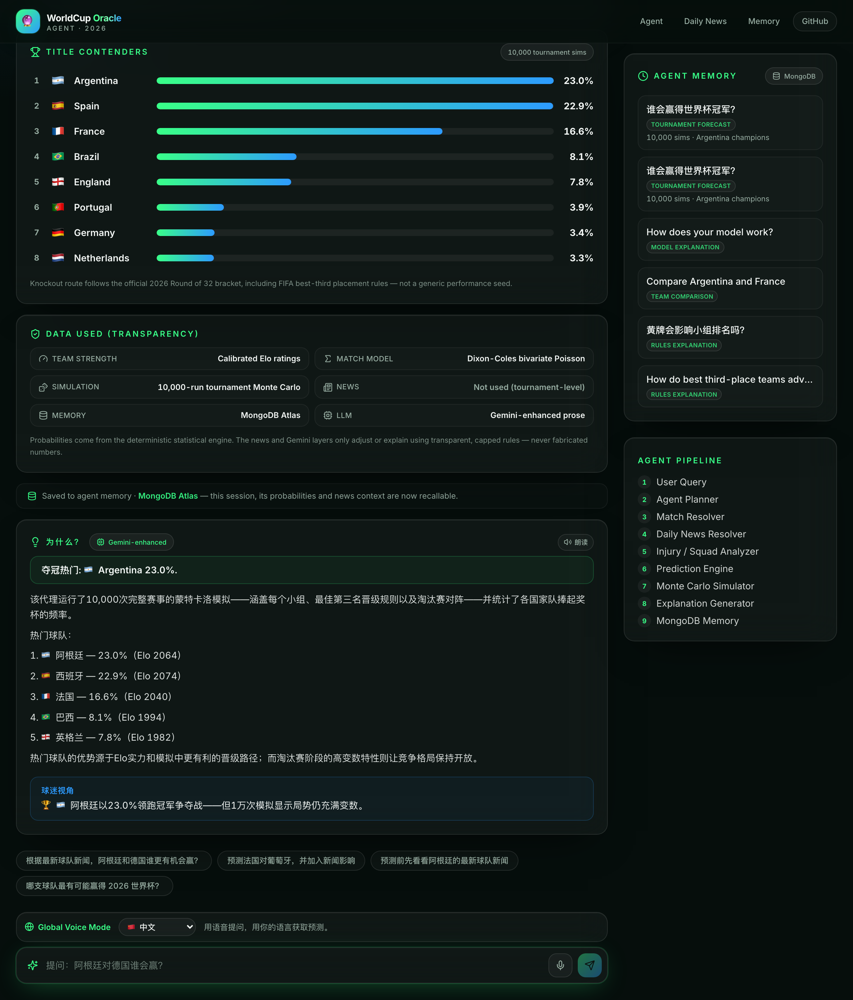 | 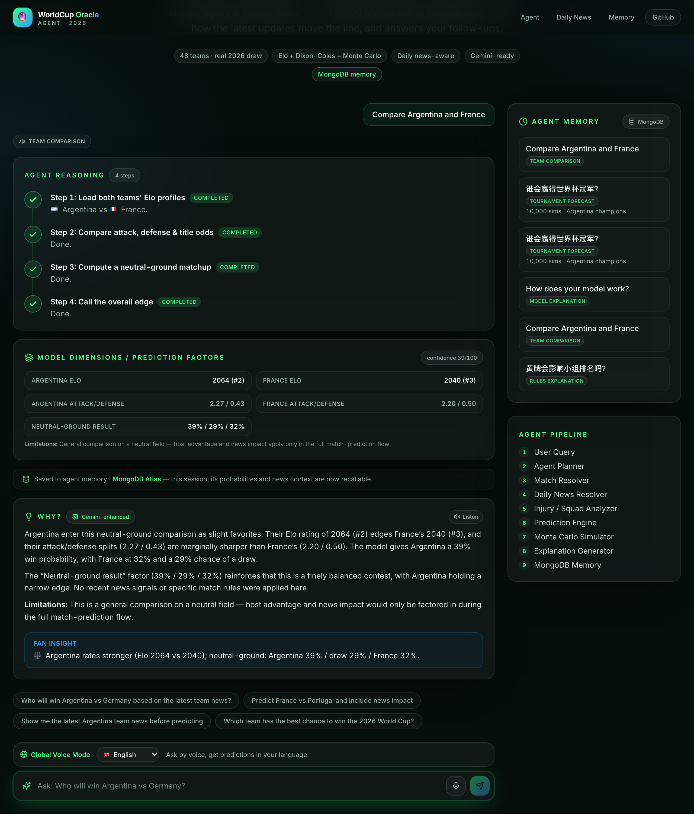 |

**Gemini — premium escalation for complex multi-step reasoning:**

| Group qualification / best-third-place — **Gemini-enhanced** | Path to the final — **Gemini-enhanced** |
|---|---|
| 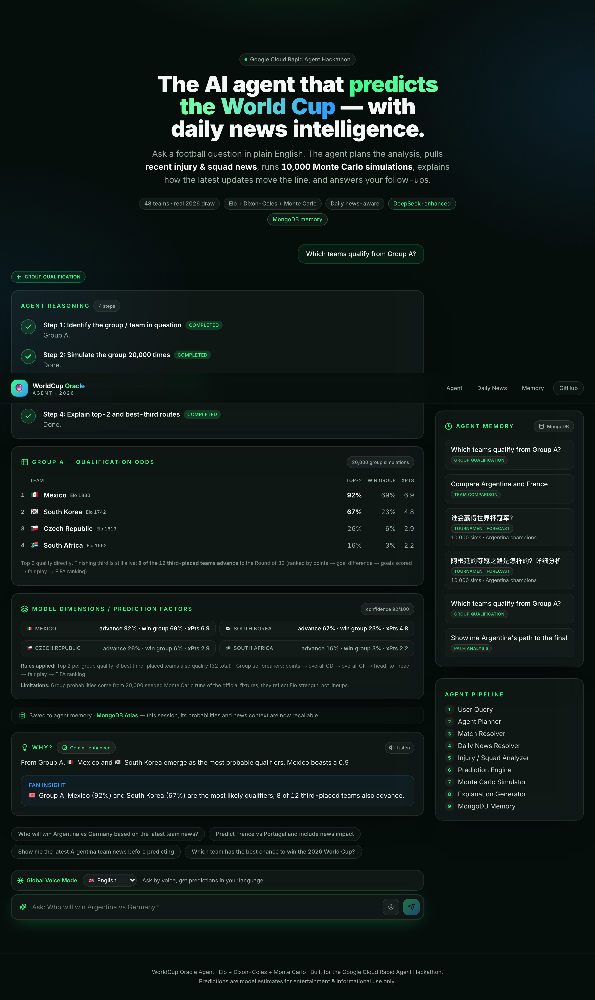 | 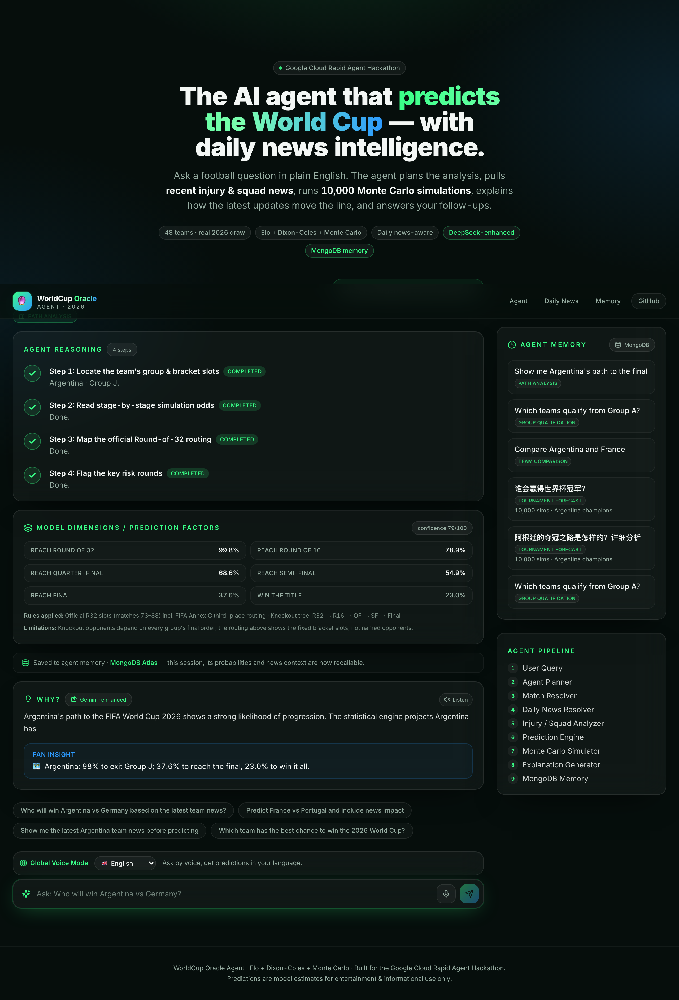 |

**Agent Memory Center (`/memory`) — MongoDB Atlas backend with multiple intent types (and `llmProvider`) persisted:**

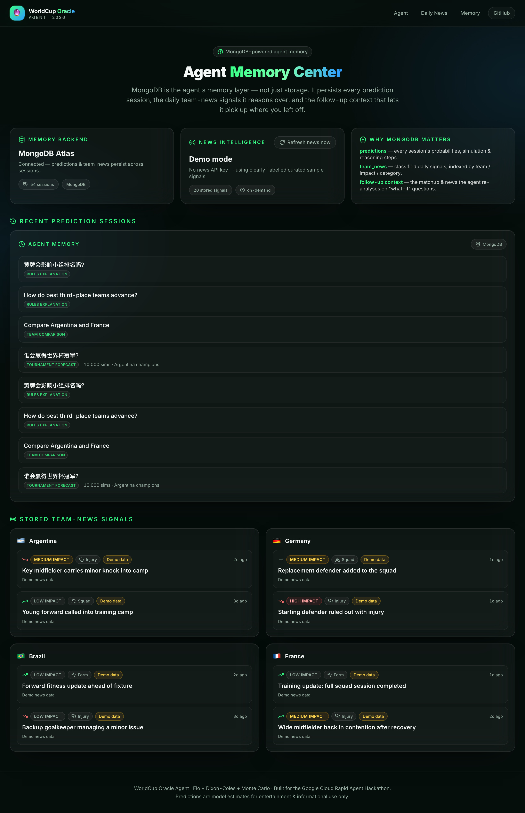

**The core flow & transparency:**

| Home — agent chat | Agent reasoning timeline |
|---|---|
| 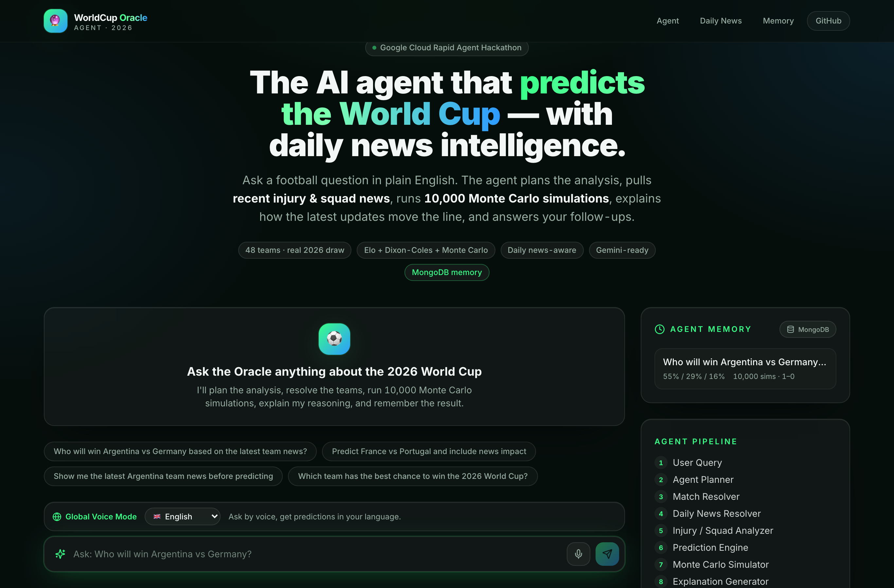 | 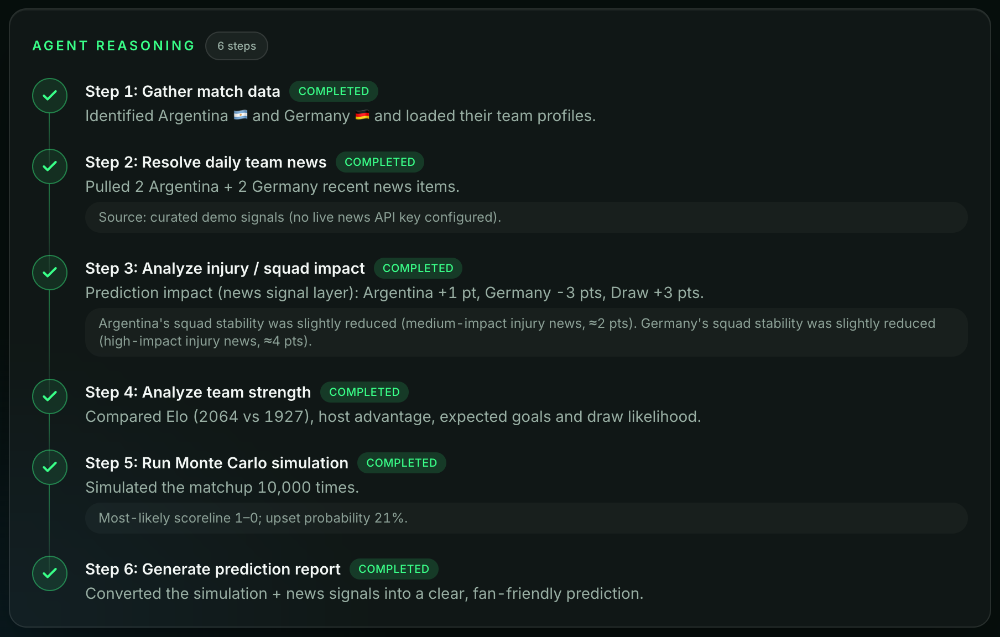 |
| **Latest News Impact (base vs adjusted)** | **Agent Memory Center (`/memory`) — MongoDB Atlas + saved sessions** |
| 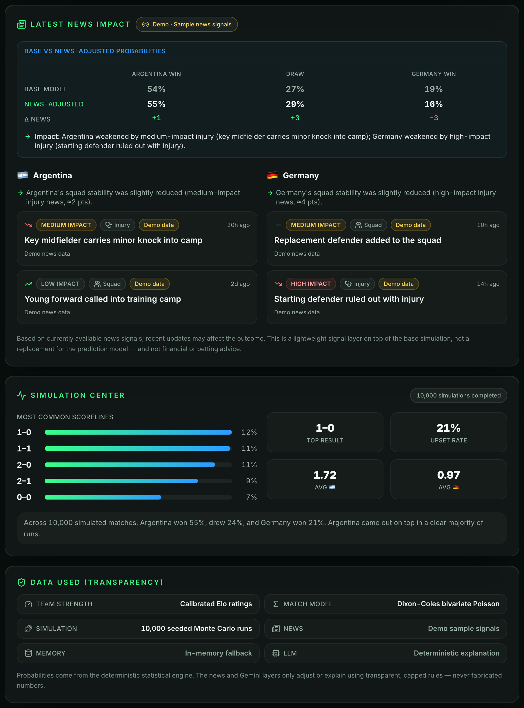 | 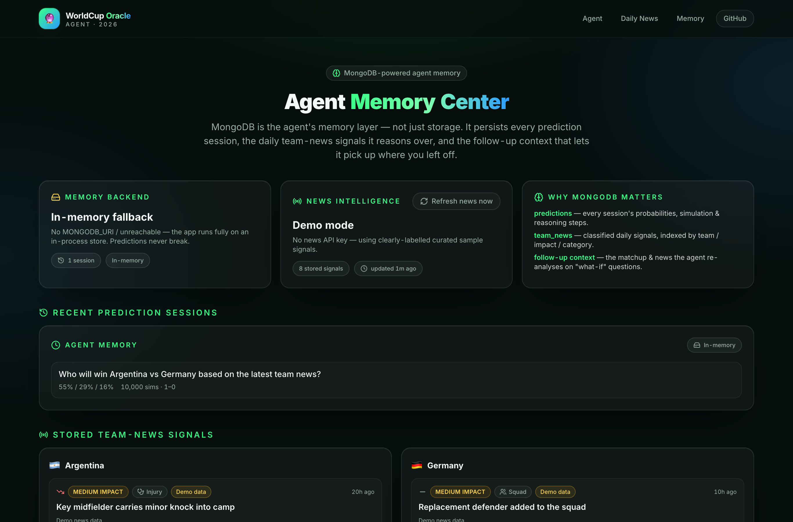 |
| **Data Transparency — `Memory: MongoDB Atlas`** | **Daily Team News (`/news`) — `team_news` collection** |
| 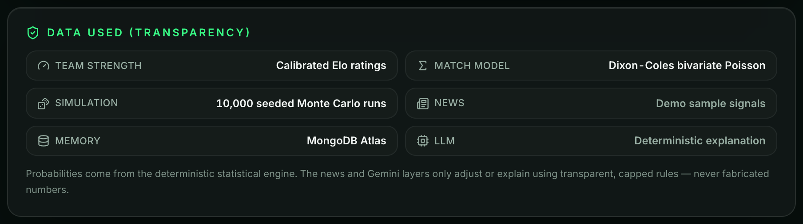 | 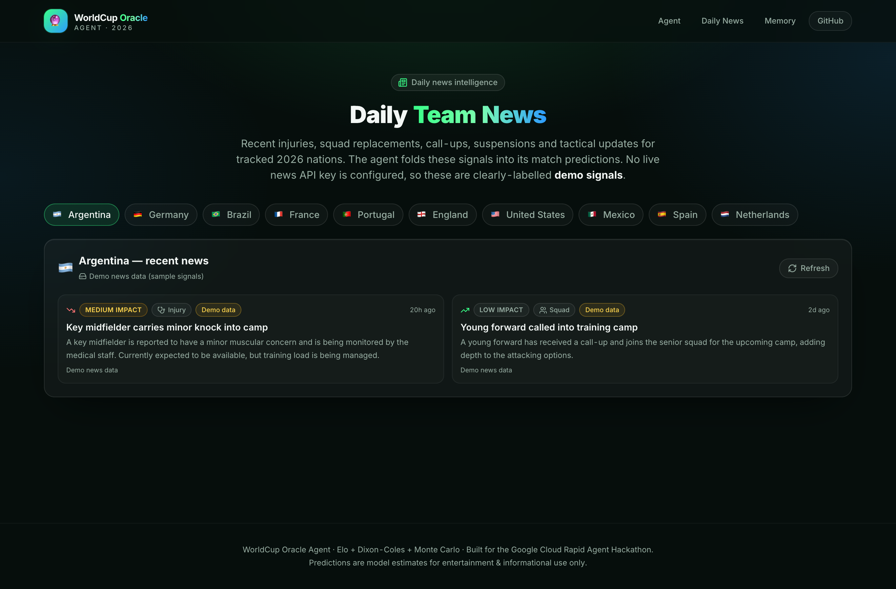 |

**Global Voice Mode** — ask by voice & get predictions in 5 languages:

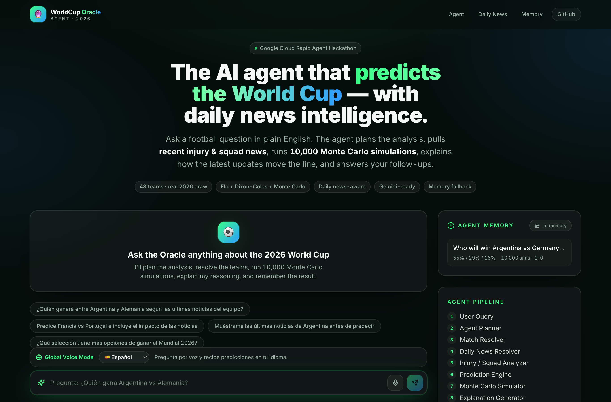

---

## What it does

1. **Understands** a natural-language football question.
2. **Plans** the right analysis (single match · what-if scenario · tournament winner · social preview · **team-news digest**).
3. **Resolves** the teams from casual names (`USA`, `Türkiye`, `the Netherlands`) → canonical profiles.
4. **Pulls recent team news** — injuries, returns, call-ups, suspensions, tactical & form updates — for both teams.
5. **Scores news impact** with a transparent, capped signal layer and **nudges the probabilities**.
6. **Analyzes** team strength (Elo, host advantage, expected goals, draw likelihood).
7. **Simulates** the matchup **10,000 times** with a seeded Monte Carlo engine.
8. **Generates** a fan-friendly, news-aware prediction report (probabilities, scoreline, confidence, upset risk, *Latest News Impact*).
9. **Explains** the reasoning in plain English — including *how the latest news affects the matchup* — plus a fan insight and optional TikTok-style script.
10. **Remembers** every interaction in MongoDB (with a zero-config in-memory fallback).
11. **Answers follow-ups** like *"Does the injury news change the prediction?"* or *"What changed in Brazil's squad this week?"*.
12. **Shows its work** — a **Data Transparency** card on every result reveals exactly what produced it (Elo · Dixon-Coles · 10k Monte Carlo · live/demo news · MongoDB/in-memory · DeepSeek/deterministic), reflecting the live runtime state.

## Why it's an agent (not just an LLM call)

The product is built as an explicit **agent pipeline** — each stage is a real, inspectable function, and the agent's reasoning timeline is shown to the user as it works:

```
User Query
  → Agent Planner             classify intent, choose the plan        lib/agent/planner.ts
  → Match Data Resolver        free text → canonical team profiles     lib/agent/matchResolver.ts
  → Daily News Resolver        recent injuries / squad / tactics news  lib/agent/newsResolver.ts
  → Injury/Squad Impact        capped, transparent probability nudge   lib/agent/impactAnalyzer.ts
  → Prediction Engine          Elo + Dixon-Coles closed-form 1X2       lib/prediction-engine/
  → Monte Carlo Simulator      10,000 seeded simulated matches         lib/agent/simulator.ts
  → Explanation Generator      plain-English + fan insight + TikTok     lib/agent/explanationGenerator.ts
  → MongoDB Memory             persist the interaction (fail-soft)      lib/db/mongodb.ts
  → Final Answer
```

The **numbers are 100% deterministic** (a ported, calibrated statistical model). The **DeepSeek** hybrid LLM layer (with a Gemini fallback) only **understands intent, writes the analyst narrative, and localizes to Chinese** — it never invents probabilities, news, injuries, or rules, and the app works identically without it (graceful deterministic fallback). That combination — statistical rigor *plus* an agentic workflow with memory — is the whole point.

---

## 🧠 Rules-aware, multi-intent forecasting + DeepSeek hybrid

WorldCup Oracle is a **rules-aware 2026 World Cup forecasting agent** — not just a two-team matchup predictor. A deterministic intent router (with optional DeepSeek refinement) classifies your question and routes it to the right engine, in **English or 中文**:

| Intent | Example |
|--------|---------|
| **Match prediction** | *"Who wins Argentina vs Germany based on the latest news?"* |
| **Tournament forecast** | *"Who will win the World Cup?"* · *"谁会赢得世界杯冠军？"* |
| **Group qualification** | *"Which teams qualify from Group A?"* — full group odds table |
| **Team comparison** | *"Compare Argentina and France"* — side-by-side strength + neutral edge |
| **Rules explanation** | *"How do best third-place teams advance?"* · *"黄牌会影响小组排名吗？"* |
| **Model explanation** | *"How does your model work?"* |

…plus team analysis, path-to-the-final, and a daily team-news digest.

**The hybrid architecture (deterministic = source of truth):**

- **Deterministic code owns the truth** — every probability, simulation, group table, ranking, 2026 rule, and news signal comes from typed TypeScript engines (`lib/prediction-engine/*`, `lib/agent/analysis.ts`), persisted to MongoDB.
- **DeepSeek (`lib/llm/*`) does language only** — (1) **intent classification** when the deterministic guess is ambiguous, (2) the **analyst narrative**, where the structured result is its *only* source of truth (it copies the numbers, never invents them), and (3) **Chinese localization** of the answer. It is given hard rules to never fabricate probabilities, news, injuries, suspensions, or sources.
- **Fail-soft** — if `DEEPSEEK_API_KEY` is absent or the call times out, the agent falls back to its deterministic router and templated explanations with no loss of correctness. Every result's **Data Transparency** card shows the live `LLM` state.

**2026 rules awareness** — the agent reuses the validated official-format bracket (`lib/prediction-engine/bracket-2026.ts`), keeps the FIFA group tiebreaker order (points → overall GD → overall GF → head-to-head → fair play → FIFA ranking), and encodes a configurable discipline model (`lib/prediction-engine/discipline.ts`: yellow-card / red-card fair-play points and suspension thresholds) used for the suspension-risk read.

---

## Agent workflow (what the user sees)

After you ask a question, the agent shows a live **reasoning timeline**:

| Step | Status | Description |
|------|--------|-------------|
| 1 · Gather match data | ✅ Completed | Identified Argentina 🇦🇷 and Portugal 🇵🇹 and loaded their team profiles. |
| 2 · Analyze team strength | ✅ Completed | Compared Elo (2064 vs 1934), host advantage, expected goals and draw likelihood. |
| 3 · Run Monte Carlo simulation | ✅ Completed | Simulated the matchup 10,000 times. |
| 4 · Generate prediction report | ✅ Completed | Converted the simulation into a clear, fan-friendly prediction. |

…followed by a **prediction card**, a **simulation center** (scoreline distribution + averages), a plain-English **"Why?"**, a **fan insight**, and a **follow-up** rail.

---

## Tech stack

| Layer | Choice |
|-------|--------|
| Framework | **Next.js 15** (App Router) · React 19 · TypeScript |
| Styling | **Tailwind CSS** · custom dark "stadium-night" theme · lucide-react icons |
| Prediction model | **Elo → Dixon-Coles bivariate Poisson → Monte Carlo** (ported to TS) |
| Agent pipeline | Plain, typed TypeScript functions (`lib/agent/*`) — easy for judges to read |
| News intelligence | Multi-source provider abstraction (`lib/news/*`) + classifier + capped impact analyzer, with curated demo fallback |
| Memory | **MongoDB** (`mongodb` driver) — `predictions` + `team_news`, with automatic in-memory fallback |
| LLM (optional) | **DeepSeek** (`deepseek-chat` via REST) hybrid layer — intent understanding, analyst narrative & Chinese localization; Google Gemini fallback; deterministic engine remains source of truth |
| News APIs (optional) | NewsAPI · GNews · SerpAPI · Google Custom Search |
| Deploy | Vercel-ready (all external services degrade gracefully) |

### The prediction model

The statistical core is a TypeScript port of a calibrated World Cup model:

- **Elo ratings** for all 48 qualified nations (real 2026 final-draw field).
- **Dixon-Coles** bivariate Poisson goal model (ρ = −0.13) for closed-form 1X2 probabilities and a scoreline grid.
- **Monte Carlo**: a seeded PRNG (mulberry32) samples 10,000 matches per fixture for the simulation view, and a full 48-team tournament (groups → best thirds → knockouts) for title odds — memoised and reproducible.
- **Host advantage**: USA / Canada / Mexico carry a +75 Elo home bonus.

---

## 🏆 2026 World Cup format accuracy

The tournament simulation follows the **official FIFA 2026 format and bracket routing** — not a generic seeded bracket.

**Format**
- **48 teams**, **12 groups of 4** (A–L).
- Qualification to the Round of 32: **12 group winners + 12 runners-up + the 8 best third-placed teams** = **32 teams**. This is explicit in `simulateTournament()` and enforced by the validation suite.

**Group ranking (FIFA tiebreakers)** — `lib/prediction-engine/engine.ts`
1. points → 2. goal difference → 3. goals scored
4. **head-to-head** among still-tied teams (H2H points → H2H GD → H2H GF), computed from the simulated group matches
5. fair play / drawing of lots → **approximated** by team rating (Elo) then a deterministic key, because a forward Monte Carlo simulation has no disciplinary/fair-play data. *(Documented approximation.)*

The 8 best third-placed teams are ranked across groups by points → GD → GF → (fair-play/lots ≈ Elo).

**Official Round of 32 routing** — `lib/prediction-engine/bracket-2026.ts`

Every slot is fixed in advance (no performance seeding):

```
M73 2A v 2B      M74 1E v 3rd      M75 1F v 2C      M76 1C v 2F
M77 1I v 3rd     M78 2E v 2I       M79 1A v 3rd     M80 1L v 3rd
M81 1D v 3rd     M82 1G v 3rd      M83 2K v 2L      M84 1H v 2J
M85 1B v 3rd     M86 1J v 2H       M87 1K v 3rd     M88 2D v 2G
```

Round of 16 → Final follow the fixed match-number tree (89–96 → 97–100 → 101–102 → 104).

**Third-place assignment (FIFA Annex C)**

Which third-placed team fills each "3rd" slot depends on *which 8 of the 12 groups* produced the best thirds. Each slot only accepts thirds from an allowed set of groups:

| Slot | 1st-seed | Allowed third-placed groups |
|------|----------|-----------------------------|
| M74 | 1E | A, B, C, D, F |
| M77 | 1I | C, D, F, G, H |
| M79 | 1A | C, E, F, H, I |
| M80 | 1L | E, H, I, J, K |
| M81 | 1D | B, E, F, I, J |
| M82 | 1G | A, E, H, I, J |
| M85 | 1B | E, F, G, I, J |
| M87 | 1K | D, E, I, J, L |

`assignThirdPlaceSlots()` resolves the 8 qualifying groups to these slots with a **deterministic bipartite matching** that honours the allowed sets — guaranteeing a rules-valid assignment for **all C(12,8) = 495 combinations** (verified by the test suite). An optional `EXACT_ANNEX_C` table can pin FIFA's exact published slot for any combination; the matcher is the safe, fully-covering fallback.

**Validate it**

```bash
npm run validate:bracket
```

Confirms: official R32 spec (no generic seeding) · 12 winners + 12 runners-up + 8 thirds placed correctly · all 495 Annex C combinations resolve to allowed slots · every R32 has exactly 32 distinct teams · champion Monte Carlo runs with a monotonic reach funnel.

**Current limitations**
- Fair-play / drawing-of-lots tiebreakers are approximated (Elo + deterministic key) — no disciplinary data exists in a forward simulation.
- `EXACT_ANNEX_C` overrides are not yet populated; for the rare combinations with more than one valid matching, the computed slot may differ from FIFA's published row (still always rules-valid). Marked with a `TODO(annex-c)`.

---

## 📰 Daily news intelligence

This is what makes the agent feel *current*. Instead of reasoning only over static team strength, it pulls recent team news and folds it into the prediction.

### How news ingestion works

```
provider.fetchTeamNews()  →  classify()  →  store (team_news)  →  agent reads it at prediction time
   lib/news/newsProvider.ts   newsClassifier.ts   teamNewsStore.ts        lib/agent/newsResolver.ts
```

- **`lib/news/newsProvider.ts`** — a pluggable, multi-source abstraction. The first configured provider wins: **NewsAPI**, **GNews**, **SerpAPI (Google News)**, or **Google Custom Search**. Every call is timed out and wrapped, so a flaky API can never break a prediction.
- **`lib/news/newsClassifier.ts`** — deterministic keyword heuristics tag each item with a **category** (`injury · squad · form · tactics · suspension · coach · other`), an **impact level** (`low · medium · high`), a **direction** (`negative · positive · neutral`) and any generic role mentions.
- **`lib/news/teamNewsStore.ts`** — persists to MongoDB `team_news` (indexed), with an in-memory fallback.
- **`lib/news/newsIngestor.ts`** — orchestrates fetch → classify → store, and seeds curated demo signals when the store is empty.
- **`lib/agent/newsResolver.ts` + `impactAnalyzer.ts`** — the agent's news steps at prediction time.

### Demo-safe fallback (no API key needed)

With **no news/search API key**, the agent uses curated **demo signals** for Argentina, Germany, Brazil, France, Portugal, England, USA, Mexico, Spain and Netherlands. To keep things honest:

- every demo item is flagged and shown in the UI as **"Demo news data / sample signals"** — never presented as verified real news;
- demo player references are **generic** ("key midfielder", "starting defender", "young forward") so nothing is falsely attributed to a real person. Real names only ever appear from a live API.

### How news adjusts the probabilities

A deliberately **simple, transparent, capped** signal layer on top of the base simulation (`lib/agent/impactAnalyzer.ts`):

| Impact | Effect on the affected team's win probability |
|--------|-----------------------------------------------|
| **High** (e.g. defender ruled out) | −4.5 pts to that team; redistributed ~60/40 to the opponent's win and the draw |
| **Medium** | −2 pts |
| **Low** | mentioned in reasoning, **no** probability change |

Positive news (a key player returning) nudges the other way. Each team's total swing is **capped at ±10 pts**, and probabilities are re-normalised to exactly 100%. The UI shows the **base → adjusted** shift per outcome.

> *News impact is a lightweight signal layer on top of the base simulation, not a replacement for the prediction model — and not financial or betting advice.* The agent uses careful language: *"Based on currently available news signals…"*

### News API routes

| Route | What it does |
|-------|--------------|
| `GET \| POST /api/news/refresh` | Refresh news for all tracked teams (`?team=brazil` for one). Fetches → classifies → stores. Returns a summary. |
| `GET /api/news/team/[team]?limit=8` | Recent news for one team, newest first (limit 1–10). |

### Scheduling the daily refresh

The refresh endpoint is designed to be hit once a day by any scheduler:

- **Vercel Cron** — already wired in [`vercel.json`](vercel.json):
  ```json
  { "crons": [{ "path": "/api/news/refresh", "schedule": "0 6 * * *" }] }
  ```
- **GitHub Actions / any cron** — `curl -fsS https://<your-app>/api/news/refresh`

If a refresh fails, the app keeps running on existing (or demo) data.

---

## MongoDB usage (Partner Track)

Every agent interaction is persisted as the agent's **memory**, powering the "Recent Predictions" rail.

**Schema** (`lib/db/mongodb.ts`):

```ts
{
  userQuery: string,
  intent: string,
  teams: string[],
  prediction: { teamAWin, draw, teamBWin, confidence } | null,
  simulationResult: { simulationsRun, mostLikelyScore, upsetProbability, summary } | null,
  reasoningSteps: string[],
  explanation: string,
  followUpContext: string,
  createdAt: Date
}
```

- `POST /api/agent/predict` → runs the agent and **saves** the interaction.
- `GET  /api/predictions/recent` → **fetches** recent predictions for the memory rail.

### `team_news` collection

The daily news intelligence layer uses a second collection, **`team_news`**, indexed on **`team` + `publishedAt`**, **`category`** and **`impactLevel`** (created automatically on first write). Each document is a `TeamNewsItem`:

```ts
{
  team: string, title: string, summary: string,
  category: "injury" | "squad" | "form" | "tactics" | "suspension" | "coach" | "other",
  impactLevel: "low" | "medium" | "high",
  direction: "negative" | "positive" | "neutral",
  affectedPlayers: string[],
  sourceName: string, sourceUrl: string,
  publishedAt: Date, createdAt: Date,
  demo: boolean   // true for curated sample signals
}
```

**Fail-soft guarantee:** if `MONGODB_URI` is missing, invalid, or unreachable, both collections transparently use an in-process memory store with a short connection timeout. **MongoDB errors never break a prediction** — the UI even shows which backend served the data (`MongoDB` vs `In-memory`).

---

## 🧠 Agent Memory Center (MongoDB Track) — ✅ live on Atlas

**The production app runs on MongoDB Atlas.** Visit **[`/memory`](https://worldcup-oracle-agent.vercel.app/memory)** for a live view of the agent's MongoDB-backed memory — MongoDB is the agent's **memory layer, not just storage**:

- **Memory backend** — shows **MongoDB Atlas** (connected) with live session count; falls back to in-memory only if the database is ever unreachable.
- **Recent prediction sessions** — every prediction is saved to the **`predictions`** collection and replayed here.
- **Stored team-news signals** — classified items from the **`team_news`** collection, per team.
- **News intelligence status** — Live (with provider) vs Demo mode, total stored signals, and **last news update** time. A **"Refresh news now"** button triggers the daily-style refresh on demand.
- **Why MongoDB matters** — `predictions` + `team_news` + follow-up context, called out explicitly.

Every prediction result also carries a **Data Transparency** card that displays **`Memory: MongoDB Atlas`** when the session was persisted to the database.

Status is also available as JSON at **`GET /api/memory/status`**.

---

## Cost-aware LLM layer — DeepSeek (default) + Gemini (premium escalation)

The agent uses a **cost-aware provider router**: DeepSeek handles routine narrative/localization tasks, while Gemini is reserved for complex multi-step reasoning, ambiguous intent resolution, and fallback. The deterministic engine is always the source of truth for every number, rule, and ranking.

```
selectLLMProvider(structuredResult, query, language, complexity) → "deepseek" | "gemini" | "none"
```

- **Deterministic router first** — confident intent + structured result ⇒ that result is the source of truth.
- **DeepSeek** (`lib/llm/provider.ts` + `deepseek.ts`, `deepseek-chat`) — the **low-cost default**: routine intent refinement, standard analyst narrative, Chinese localization, team comparison, model explanation, common questions.
- **Google Gemini** (`lib/llm/gemini.ts`, `gemini-2.5-flash`) — the **premium escalation**, chosen by `assessComplexity()` for: path-to-final, group qualification / best-third-place logic, rules + prediction combined, more than two teams, ambiguous intent, low deterministic confidence, or long-form Chinese explanations — and as the **fallback when DeepSeek fails/times out**.
- **Graceful fallback** — Gemini missing → DeepSeek; neither → deterministic templates.

A 6–9s timeout means a slow API can never stall the demo. The **Data Transparency** card and the "Why?" badge show the **actual provider used** (`DeepSeek-enhanced` / `Gemini-enhanced` / `Deterministic engine`), and that provider is persisted to MongoDB with the result. Routing decisions are covered by `npm run test:routing` (22 checks). We never claim Gemini generates answers it didn't — the numbers are always deterministic.

> **MCP-assisted development/deployment:** the deploy used the **Vercel MCP** (project/deployment inspection; env + redeploy via the Vercel CLI) and **browser/preview MCP** tooling to capture these production screenshots. No MCP server runs inside the deployed app, and **MongoDB MCP / GitHub MCP / Google Cloud Agent Builder were not used** — MongoDB is a runtime integration via the official `mongodb` driver. See the **Hackathon compliance** table in [`DEVPOST.md`](DEVPOST.md).

---

## 📡 Live tournament state (no predicting eliminated teams)

The agent has a **deterministic tournament-state layer** so it never keeps offering an eliminated team as a possible champion. It is fed by a **real sports data API** — **API-Football / API-SPORTS** (fixtures, standings, injuries) or **football-data.org** (fixtures/results, v4 `X-Auth-Token`) — normalized to the app's canonical team IDs and **cached aggressively in MongoDB** (free-tier friendly).

- **Source of truth is data, not the LLM/news.** `lib/live-sports/*` classifies each team `active · qualified · eliminated · unknown`. Elimination is only inferred from **direct evidence** (a finished knockout loss); group-stage is never guessed (best-third maths), so the agent **never falsely eliminates** a team.
- **Deterministic gating overrides the model.** Before champion/path/team analysis, eliminated teams are removed from title contention (champion probability → 0). Ask *"Can Portugal still win?"* after elimination and the answer is a hard **"No — already eliminated based on the latest tournament state"** — the LLM cannot override it.
- **MongoDB cache** (`team_state`, `live_fixtures`, `live_injuries`): fixtures/standings ~2h TTL, injuries ~8h. If the API is down, the **last known cached state** is used; with no cache and no key, the app shows **Demo** (all active, clearly labelled) and never fabricates an elimination.
- **Transparency badge** on answers: `Tournament State: Live API / Cached / Demo / Unavailable`, last-updated time, source, and eliminated-team count. Also exposed at `GET /api/memory/status`.
- **News stays article-only** — GNews/NewsAPI/SerpAPI provide injuries/squad context, never elimination.
- Enable with **either** `API_FOOTBALL_KEY` (API-SPORTS; preferred when both set — includes injuries) **or** `FOOTBALL_DATA_API_KEY` (football-data.org; fixtures/results, no injuries on the free tier). Gating logic is covered by `npm run test:tournament` (25 checks).

---

## 🗣️ Global Voice Mode

Football is global — so the agent speaks five languages and listens too. A compact
**Global Voice Mode** bar lets fans pick a language, **ask by voice**, and **hear the
answer read aloud** in their language.

**Supported languages:** English (`en-US`) · 中文 (`zh-CN`) · Español (`es-ES`) ·
Português (`pt-BR`) · 日本語 (`ja-JP`).

The selected language drives the suggested prompts, the spoken/typed input language,
the response language, and the text-to-speech voice.

- **Voice input** uses the browser's native **Web Speech API**
  (`SpeechRecognition` / `webkitSpeechRecognition`) — no dependency, no API key. The mic
  button shows `Listening…`, and degrades gracefully with clear messages for
  *not supported* / *permission denied*. If unavailable, text input works exactly as before.
- **Voice output** uses the browser's native **`speechSynthesis`** — a per-answer
  **Listen / Stop** button. Audio never autoplays; the user clicks to play. The button hides
  if the browser can't speak.
- **Response language** — the numbers are always produced by the deterministic engine and
  **never change during translation**. A deterministic, in-language **result summary**
  (built from the structured numbers) is always shown and spoken. When `GOOGLE_API_KEY` is
  set, **Gemini** additionally rewrites the full explanation in the chosen language with
  strict "keep every number exact" instructions; without it, the localized summary + localized
  UI labels carry the language (English detail remains) — **no extra API key is required for
  basic voice mode**.
- **Multilingual team resolution** — localized team aliases (Spanish/Portuguese + Chinese/
  Japanese) let free voice/typed questions like *"阿根廷对德国"* or *"Argentina vs Alemania"*
  resolve correctly. Suggested prompts submit an English canonical query under the hood, so the
  flagship demo is rock-solid in every language.

**Browser support:** voice **input** is best in Chrome/Edge (and Chromium); Safari support is
partial; Firefox lacks `SpeechRecognition` (the mic button simply hides). Voice **output**
works in all modern browsers. Everything falls back to text gracefully.

---

## Run it locally

```bash
git clone https://github.com/bobaoxu2001/worldcup-oracle-agent.git
cd worldcup-oracle-agent
npm install
npm run dev          # http://localhost:3000
```

**No `.env` needed.** With zero configuration the agent fully works: deterministic predictions + simulations + explanations, predictions persisted to in-memory storage.

### Environment variables (all optional)

Copy `.env.example` → `.env.local` and fill in only what you want:

| Variable | Purpose | If missing |
|----------|---------|------------|
| `MONGODB_URI` | Agent memory + `team_news` + live tournament-state cache | Falls back to in-memory store |
| `API_FOOTBALL_KEY` | Live fixtures/standings/results/injuries (API-SPORTS) → deterministic elimination | Demo mode (all teams active, never falsely eliminated) |
| `FOOTBALL_DATA_API_KEY` | Live fixtures/results via football-data.org (alternative provider) | Demo mode (as above) |
| `MONGODB_DB` | Database name (default `worldcup_oracle`) | Uses default |
| `AI_PROVIDER` | Selects the hybrid LLM provider (e.g. `deepseek`) | Deterministic generator |
| `DEEPSEEK_API_KEY` | DeepSeek intent/narrative/localization (active LLM in prod) | Deterministic generator |
| `DEEPSEEK_BASE_URL` | DeepSeek API base (e.g. `https://api.deepseek.com`) | Uses default |
| `DEEPSEEK_MODEL` | DeepSeek model id (e.g. `deepseek-chat`) | Uses default |
| `GOOGLE_API_KEY` | Gemini narrative polish + preferred translation path | Falls back to DeepSeek, then deterministic |
| `NEWS_API_KEY` | Live team news via NewsAPI.org | Uses curated demo signals |
| `GNEWS_API_KEY` | Live team news via GNews.io | Uses curated demo signals |
| `SERPAPI_API_KEY` | Live team news via SerpAPI (Google News) | Uses curated demo signals |
| `GOOGLE_SEARCH_API_KEY` + `GOOGLE_SEARCH_ENGINE_ID` | Live team news via Google Custom Search | Uses curated demo signals |
| `NEXT_PUBLIC_APP_URL` | Absolute URL for metadata | Defaults to `localhost:3000` |

> Configure **any one** of the news providers to go live — the first one set wins. With none set, the agent runs on clearly-labelled demo signals.

> **No environment variables are required for the demo.** Without keys, the app runs in
> **deterministic + demo-news + in-memory** fallback mode and every feature still works.

### Deploy to Vercel

1. Import the repo at [vercel.com/new](https://vercel.com/new) (framework auto-detects as Next.js).
2. **No env vars needed** for a working demo. To enable the live paths, add any of the variables above in **Project → Settings → Environment Variables**:
   - `MONGODB_URI` (+ optional `MONGODB_DB`) → real agent memory (Atlas)
   - `GNEWS_API_KEY` (or `SERPAPI_API_KEY` / `NEWS_API_KEY` / `GOOGLE_SEARCH_API_KEY` + `GOOGLE_SEARCH_ENGINE_ID`) → live news
   - `AI_PROVIDER=deepseek` + `DEEPSEEK_API_KEY` (+ `DEEPSEEK_BASE_URL`, `DEEPSEEK_MODEL`) → DeepSeek-enhanced narratives & Chinese localization
   - `GOOGLE_API_KEY` → enable Gemini for narrative polish / preferred translation
   - `NEXT_PUBLIC_APP_URL` → your deployed URL (for metadata/OG)
3. Deploy. The included [`vercel.json`](vercel.json) registers a **daily cron** that calls `/api/news/refresh` at 06:00 UTC to keep `team_news` fresh.
4. Paste the resulting URL into the table at the top of this README and into `DEVPOST.md`.

Build is standard `next build` — verified locally green; all external services degrade gracefully, so the first deploy succeeds even with zero env vars.

#### Enable MongoDB Atlas memory (already live in production)

The hosted demo is already connected to **MongoDB Atlas**. To enable it on your own
fork / self-host (the `Memory: MongoDB Atlas` badge):

1. Create an Atlas cluster + a `readWrite` DB user, and under **Network Access** allow
   `0.0.0.0/0` (Vercel's serverless IPs are dynamic).
2. Provision collections + indexes (reads `MONGODB_URI` from the env — never hard-coded):
   ```bash
   export MONGODB_URI="<your-atlas-srv-uri>"   # keep this out of git
   export MONGODB_DB="worldcup_oracle"
   npm run setup:mongo
   ```
   This creates the `predictions` (`createdAt`, `teams`, `intent`) and `team_news`
   (`team+publishedAt`, `category`, `impactLevel`, `demo`) indexes, and seeds demo
   signals (`demo:true`) only if `team_news` is empty.
3. Add `MONGODB_URI`, `MONGODB_DB`, and `NEXT_PUBLIC_APP_URL` in **Vercel → Project →
   Settings → Environment Variables**, then redeploy. The connection string lives only in
   Vercel env / a gitignored `.env.local` — never in the repo.

### Scripts

```bash
npm run dev        # dev server
npm run build      # production build
npm run start      # serve production build
npm run lint       # eslint
npm run typecheck  # tsc --noEmit
```

---

## Demo prompts

Paste any of these into the agent:

1. `Who will win Argentina vs Germany based on the latest team news?` — **the flagship** news-aware demo
2. `Does Germany's injury news change the prediction?` — news-driven re-analysis
3. `What if Germany's injured defender returns?` — scenario re-analysis (odds recover)
4. `Show me the latest Argentina team news before predicting` — team-news digest
5. `Which team has the best chance to win the 2026 World Cup?` — full-tournament Monte Carlo

More to try: `Predict France vs Portugal and include news impact` · `What changed in Brazil's squad this week?` · `Give me a TikTok-style match preview for England vs Germany`

Also visit **`/news`** (Daily Team News) to browse recent injuries / squad / tactics updates per team and trigger a manual refresh.

---

## Hackathon relevance

WorldCup Oracle Agent transforms a traditional World Cup prediction model into a **daily news-aware AI agent** that can reason through football matchups, factor in the latest injuries and squad changes, run simulations, generate fan-friendly predictions, and remember previous prediction sessions. It combines **statistical modeling** with a full **agent workflow** — planning, data resolution, **daily news intelligence**, impact analysis, simulation, reasoning, explanation, and memory — which is exactly what the Rapid Agent Hackathon (and the MongoDB Partner Track) reward.

## Future roadmap

- **Native Gemini function-calling** so the LLM drives the pipeline (planner → tools) instead of only narrating.
- **Richer news ingestion** — dedupe across providers, entity resolution to real player names, recency weighting.
- **Multi-turn memory recall** — the agent cites its own past predictions and news in follow-ups.
- **Bracket builder** — simulate a user's custom knockout path.
- **Vector search over news & historical matches** (MongoDB Atlas Vector Search) for "find similar fixtures / situations."

---

## ✅ Submission checklist

- [x] **Agentic product** — explicit, inspectable pipeline (planner → resolver → news → impact → engine → simulator → explainer → memory) with a visible reasoning timeline.
- [x] **MongoDB Track — live on Atlas** — prediction sessions persist to `predictions`, news to `team_news` (both indexed); `/memory` shows the **MongoDB Atlas** backend + recent saved sessions, and each result's Data Transparency card reads `Memory: MongoDB Atlas`.
- [x] **Cost-aware LLM routing** — DeepSeek default + **Gemini** (`lib/llm/gemini.ts`, live in prod) premium escalation for complex/ambiguous queries + fallback; deterministic when no key. Routing tested via `npm run test:routing`.
- [x] **Runs with zero config** — predictions, simulations, news and memory all work with an empty `.env`.
- [x] **Fail-soft** — missing/invalid MongoDB, Gemini or news keys never break the demo.
- [x] **Open source** — [MIT `LICENSE`](LICENSE).
- [x] **Docs** — README + [`DEVPOST.md`](DEVPOST.md) (pitch, build, demo + 3-min video script).
- [x] **Quality gates** — `npm run typecheck`, `npm run build`, `npm run validate:bracket` all pass.
- [x] **Live demo URL** — deployed to Vercel: https://worldcup-oracle-agent.vercel.app
- [ ] **Demo video** — record the 3-minute script in `DEVPOST.md` and paste the link.

## 📜 License

This project is open source under the [MIT License](LICENSE) — free to use, modify, and distribute. © 2026 WorldCup Oracle Agent contributors.

---

*Predictions are model estimates for entertainment & informational use only. Not betting or financial advice.*
